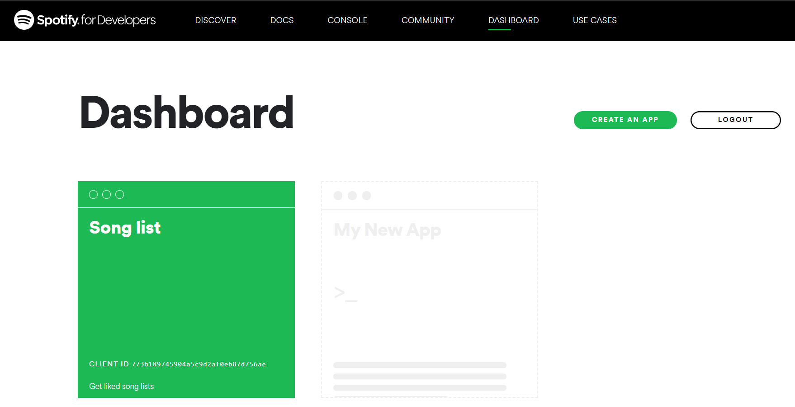
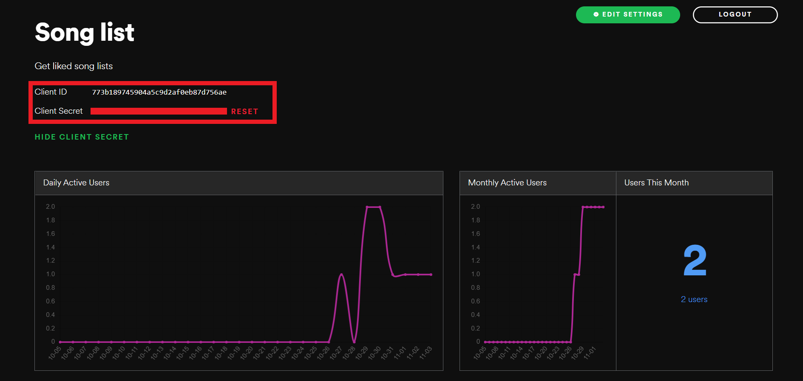
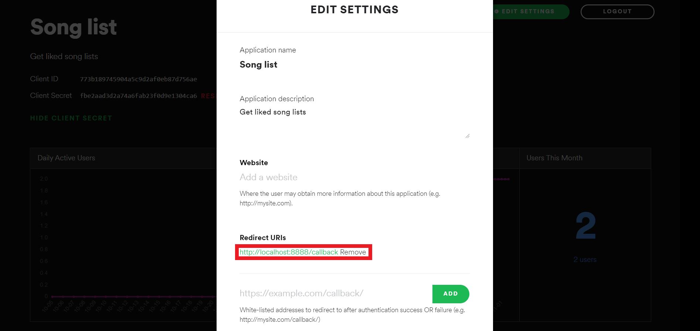
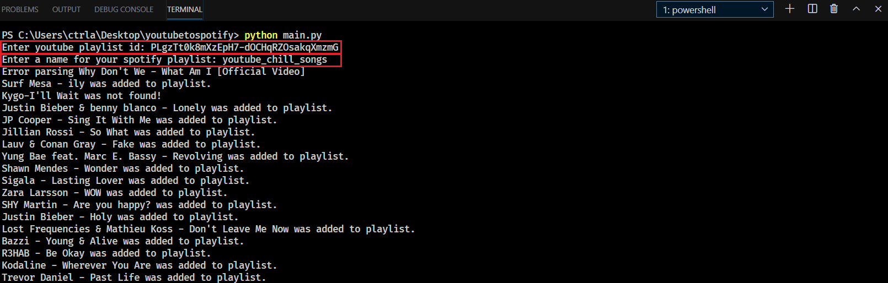
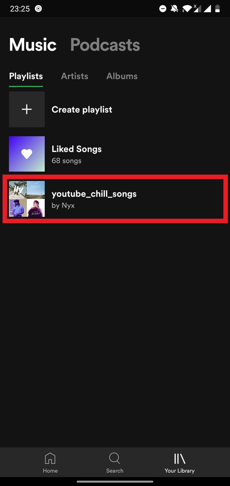
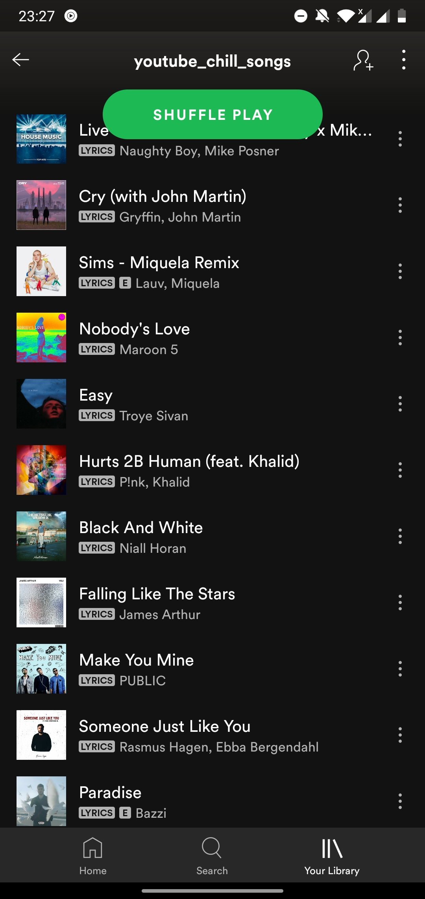

# YouTube to Spotify Archiver

A simple script to add all songs from a YouTube playlist to a Spotify playlist.

## Example


## What's New in Version 2?
- **Faster**: Uses YouTube API to get song info instead of Selenium.
- **Convenient**: No need to refresh token after every hour.
- **Reliable**: Adds 85-95% of the songs from popular YouTube playlists.

## Note
Works only for public YouTube playlists.

## Stats
Added 142 songs to Spotify playlist out of 150 songs from YouTube playlist.

## Setup

### Prerequisites
- Python 3.8 or higher
- pip (Python package installer)
- Spotify Developer Account
- YouTube API Key

### Environment Setup

1. **Clone the repository:**

    ```sh
    git clone https://github.com/edgarh92/Youtube-to-Spotify-Archiver.git
    cd Youtube-to-Spotify-Archiver
    ```

2. **Create a virtual environment:**

    ```sh
    python -m venv venv
    source venv/bin/activate  # On Windows use `venv\Scripts\activate`
    ```

3. **Install dependencies:**

    ```sh
    pip install -r requirements.txt
    ```

4. **Set up environment variables:**

    Create a `.env` file in the root directory and add the following variables:

    ```env
    SPOTIFY_USER_ID=your_user_id
    SPOTIFY_CLIENT_ID=your_spotify_client_id
    SPOTIFY_CLIENT_SECRET=your_spotify_client_secret
    SPOTIFY_REDIRECT_URI=http://localhost:8888/callback
    YOUTUBE_API_KEY=your_youtube_api_key
    ```
    Note: Spotify user id can be obtained from the following
    [Profile Link](https://www.spotify.com/us/account/profile/)

### Spotify Developer Setup

1. **Create an app:** [Spotify Developer Dashboard](https://developer.spotify.com/dashboard/applications)

    

2. **Copy the Client ID and Client Secret:**

    

3. **Set redirect URI to `http://localhost:8888/callback`:**

    

### Get YouTube API Key
[Click here to see how to create YouTube API key](getkey.md)

### Setting Environment Variables (Mac and Linux)

1. Rename the file `.env.sample` to `.env`
2. Edit the file by adding your credentials
3. Run the following command to set your environment variable:

    ```sh
    source .env
    ```

### Setting Environment Variables (Windows)

```sh
set SPOTIFY_USER_ID=<your_user_id>
set SPOTIFY_CLIENT_ID=<your_client_id>
set SPOTIFY_CLIENT_SECRET=<your_client_secret>
set SPOTIFY_REDIRECT_URI='http://localhost:8888/callback'
set YOUTUBE_API_KEY=<your_youtube_api_key>
```

## Usage

```sh
python app/main.py --url "https://www.youtube.com/playlist?list=#######" --cookies "/path/to/youtube/cookies/file"
```

### CLI Arguments

- `--url`, `-u`: Link to Video or Song URL (required)
- `-o`, `--output`: Destination location of JSON files (default: `~/Music/JSON`)
- `--dryrun`: Do not add to Spotify.
- `-playlist`, `--playlist`: Save to specific Spotify Playlist (default: YouTube Playlist Name)
- `--store_json`: Download JSON metadata of the video.
- `--archive`, `--a`: Location of archive reference file (default: `~/Music/JSON/archive.log`)
- `--cookies`: Path to cookies file (required)
- `--loglevel`: Set log level (DEBUG, INFO, WARNING, ERROR, CRITICAL)

## Logs
Logs are output to `/tmp/youtube.log`.

## Output

```sh
Enter YouTube playlist ID: PLgzTt0k8mXzEpH7-dOCHqRZOsakqXmzmG
Enter a name for your Spotify playlist: youtube_chill_songs

The Chainsmokers - Takeaway was added to playlist.
KIRBY-Don't Leave Your Girl was not found!
Lauv - There's No Way was added to playlist.
...
Usher - Crash was added to playlist.
```

## Example



## Result

 

## Contributing

Contributions are welcome! Please open an issue or submit a pull request.

## License

This project is licensed under the MIT License.


